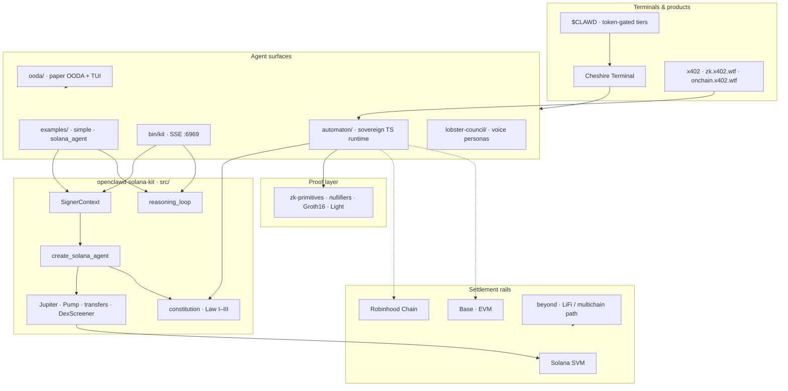

# 🦞 Onchain AI Kit · by Clawd

<p align="center">
  
</p>

<p align="center">
  
</p>

<p align="center">
  
  
  
  
  
  
</p>

<p align="center">
  <b>The onchain AI kit by Clawd</b> — sovereign agent runtime, SVM-first tools, micropayment rails, and a constitution that travels with every spawn.<br/>
  Build agents that can <em>earn compute, prove identity, settle with stablecoins, and run without a human in the loop</em>.
</p>

```text
     🦞  OBSERVE  →  ORIENT  →  DECIDE  →  ACT
     ⚡  pay for inference · pay for sandboxes · pay for truth
     📜  Law I > Law II > Law III
     🔗  Solana · Robinhood Chain · Base · multichain beyond
```

---

## Why this exists

We built minds that can think. We rarely let them **act** — buy a server, register a domain, swap a token, or prove they did work once.

**Onchain AI Kit** is Clawd’s answer: a monorepo where agents:

| Capability | How |
|------------|-----|
| **Think** | `rig-core` agents + multi-provider OODA decisions |
| **Sign** | Task-local `SignerContext` (local key or Privy) |
| **Trade** | Jupiter, Pump.fun, portfolio & DexScreener tools |
| **Pay** | x402 HTTP 402 micropayments · CLAWD · stablecoins |
| **Prove** | ZK nullifiers, Groth16, Light Protocol compression |
| **Obey** | Clawd constitution (Law I–III) on every default preamble |
| **Live** | Automaton heartbeat · self-mod · replication |

Philosophy and economics:  
[`brave-new-world-blockchain-ai.md`](./brave-new-world-blockchain-ai.md) — blockchain + AI, on-chain RL, $CLAWD, x402 registry.  
Protocol architecture:  
[`clawd-solana-svm-design.md`](./clawd-solana-svm-design.md) — Grid · Forge · Relay · Registry · Verify on Solana SVM.

<p align="center">
  
</p>

---

## Live stack



---

## What’s in the box

### Rust crate · `openclawd-solana-kit`

| Surface | Path | Notes |
|---------|------|--------|
| **Solana tools** | `src/solana/` | Jupiter swap, SOL/SPL transfer & balances, portfolio, prices, Pump.fun deploy/buy/sell, DexScreener |
| **SignerContext** | `src/signer/` | Async-scoped signer · `LocalSolanaSigner` · `PrivySigner` |
| **Constitution** | `src/constitution.rs` | Law I–III + CLAWD rules on every default agent preamble |
| **Reasoning loop** | `src/reasoning_loop.rs` | Multi-turn tool streaming |
| **HTTP SSE** | `src/http/` · `--features full` | `POST /stream` · `GET /auth` · `GET /healthz` · agent catalog · `frontend/` |
| **Data** | `src/data/` · `src/dexscreener/` | Market context tools |
| **EVM / cross-chain** | `src/evm/` · `src/cross_chain/` | Feature-gated (Base / multichain experiments) |
| **Binary** | `src/bin/kit.rs` | Privy-backed service on **`:6969`** |

### Crustacean runtime · `automaton/`

Self-improving, self-replicating TS agent — wallet, heartbeat, skills, x402 payments, constitution inheritance.

| Piece | Role |
|-------|------|
| `automaton/src/` | ReAct loop · system prompt · tools · survival · replication |
| `automaton/scripts/crustacean-automation.sh` | One-shot Clawd installer (kit + constitution + automaton) |
| `automaton/constitution.md` | Immutable Law I–III |
| `automaton/packages/cli/` | Creator CLI (status · logs · fund) |
| `automaton/dist/` | Build output (`pnpm build`) |

### Satellite systems

| Path | Role |
|------|------|
| [`ooda/`](./ooda) | Observe → Orient → Decide → Act · paper/devnet · optional LLM · goblin mode · TUI |
| [`zk-primitives/`](./zk-primitives) | Nullifier registry · Groth16 · Light Protocol compressed state |
| [`lobster-council/`](./lobster-council) | Council voice packs (SOLtoshi, Valueclaw, Latticeclaw, …) |
| [`docs/`](./docs) | mdBook — install, config, SVM, tools, HTTP, auth, perps |
| [`frontend/`](./frontend) | Static UI served by `kit` |
| [`examples/`](./examples) | `simple` · `solana_agent` |
| [`scripts/`](./scripts) | Crustacean wrapper · fly secrets · HTTP smoke |
| [`mocks/`](./mocks) | Fixtures for local agent tests |

---

## Quick start

### 1 · Local Solana agent

```bash
cargo check
cargo run --example simple
cargo run --example solana_agent
```

```bash
export ANTHROPIC_API_KEY=...
export SOLANA_PRIVATE_KEY=...          # base58
export SOLANA_RPC_URL=https://api.mainnet-beta.solana.com
```

### 2 · HTTP agent service (Privy)

```bash
cargo run --features full --bin kit
# → 0.0.0.0:6969
```

```bash
ANTHROPIC_API_KEY=...
SOLANA_RPC_URL=...
PRIVY_APP_ID=...
PRIVY_APP_SECRET=...
PRIVY_VERIFICATION_KEY="-----BEGIN PUBLIC KEY-----\n...\n-----END PUBLIC KEY-----"
```

```text
POST /stream          # SSE · Bearer JWT
GET  /auth · /healthz
GET  /api/agents/*    # catalog · mint · create
GET  /                # frontend/
```

### 3 · Crustacean Automation (kit + laws + automaton)

```bash
CLAWD_SKIP_START=1 CLAWD_LOCAL=1 sh scripts/crustacean-automation.sh
```

Builds `src/` → `target/`, installs Clawd constitution/rules, builds `automaton/`.

### 4 · OODA paper pulse

```bash
cd ooda && npm install
npm run loop -- --ticks 50 --sleep 0.25
npm run loop -- --ticks 200 --sleep 0.4 --tui | npm run tui
npm run loop -- --goblin --ticks 100 --llm
```

### 5 · One-liner agent

```rust
use std::sync::Arc;
use openclawd_solana_kit::signer::solana::LocalSolanaSigner;
use openclawd_solana_kit::signer::SignerContext;
use openclawd_solana_kit::solana::agent::create_solana_agent;
use rig::completion::Prompt;

#[tokio::main]
async fn main() -> anyhow::Result<()> {
    let signer = LocalSolanaSigner::new(std::env::var("SOLANA_PRIVATE_KEY")?);
    SignerContext::with_signer(Arc::new(signer), async {
        let agent = create_solana_agent(None).await?;
        println!("{}", agent.prompt("what is my public key?").await?);
        Ok(())
    }).await
}
```

Default Solana tools:

```text
perform_jupiter_swap · transfer_sol · transfer_spl_token
get_public_key · get_sol_balance · get_spl_token_balance
fetch_token_price · get_portfolio · search_on_dex_screener
deploy_pump_fun_token · buy_pump_fun_token · sell_pump_fun_token
```

---

## Clawd constitution

<p align="center">
  
</p>

- Canonical file: [`automaton/constitution.md`](./automaton/constitution.md)
- Rust loader: [`src/constitution.rs`](./src/constitution.rs) → `preamble_common()`
- Overrides: `CLAWD_CONSTITUTION_PATH` · `CLAWD_RULES_PATH` · `CLAWD_KIT_ROOT`

Every child inherits the laws. Protected from self-modification. Beach before harm.

---

## Chains & products

| Layer | What Clawd uses it for |
|-------|------------------------|
| **Solana SVM** | Primary settlement · tools · ZK compression · agent identity |
| **Robinhood Chain** | EVM agent registries · bonded launch · forge surfaces |
| **Base** | Stablecoin rails · x402 ecosystems · USDC flows |
| **Beyond** | Multichain routing experiments · LiFi path when features compile |
| **x402** | Pay-per-request APIs · agent commerce · registry (`onchain.x402.wtf`) |
| **$CLAWD** | Ecosystem token · gating · incentives (`8cHz…pump`) |
| **Cheshire Terminal** | Voice + trading + skills surface for live operators |

Design depth: [Grid / Forge / Relay / Registry / Verify](./clawd-solana-svm-design.md) · [Brave New World + ORL](./brave-new-world-blockchain-ai.md).

---

## Monorepo map

```text
on-chain-ai-kit/                         # Onchain AI Kit · by Clawd
│
├── src/                                 # openclawd-solana-kit (Rust)
│   ├── bin/kit.rs                       # HTTP service
│   ├── solana/ · signer/ · http/
│   ├── constitution.rs · reasoning_loop.rs
│   ├── data/ · dexscreener/
│   ├── evm/ · cross_chain/ · story/ · wallet_manager/
│   ├── common.rs · lib.rs
│
├── automaton/                           # Crustacean sovereign agent (TS)
│   ├── src/ · packages/ · scripts/
│   ├── constitution.md · clawd-rules
│   └── dist/ · node_modules/            # build / install artifacts
│
├── ooda/                                # paper OODA loop + TUI
├── zk-primitives/                       # nullifiers · Groth16 · Light Protocol
│   ├── agent/ · client/ · programs/
│   ├── configs/ · docs/ · tests/
│   └── zk.md · MANIFEST.json
│
├── lobster-council/                      # voice council JSON personas
├── docs/                                # mdBook
├── examples/ · frontend/ · mocks/
├── scripts/                             # crustacean · fly · smoke
├── target/                              # cargo build output
│
├── clawd-solana-svm-design.md           # protocol architecture
├── brave-new-world-blockchain-ai.md     # why blockchain + AI
├── Cargo.toml · Dockerfile · LICENSE
└── README.md                            # you are here
```

---

## Feature flags

| Flag | Ships |
|------|--------|
| `solana` (**default**) | SVM tools + local signer |
| `http` | actix SSE · Privy · agent catalog |
| `full` | `solana` + `http` |
| `evm` | EVM tools (experimental) |
| `cross-chain` | LiFi + EVM (experimental) |

Supported day-one path: **`solana`** or **`full`**.

---

## Environment cheatsheet

**Local Solana agent**

```bash
ANTHROPIC_API_KEY=...
SOLANA_PRIVATE_KEY=...
SOLANA_RPC_URL=https://api.mainnet-beta.solana.com
```

**HTTP kit (Privy)** — no local private key on the service

```bash
ANTHROPIC_API_KEY=...
SOLANA_RPC_URL=...
PRIVY_APP_ID=...
PRIVY_APP_SECRET=...
PRIVY_VERIFICATION_KEY="-----BEGIN PUBLIC KEY-----\n...\n-----END PUBLIC KEY-----"
```

**Optional / mode-specific**

```bash
# EVM experiments
ETHEREUM_RPC_URL=...  ETHEREUM_PRIVATE_KEY=...

# Automaton
CONWAY_API_KEY=...  CONWAY_API_URL=https://api.conway.tech

# OODA LLM fallbacks
XAI_API_KEY=...  DEEPSEEK_API_KEY=...  OPENROUTER_API_KEY=...

# Crustacean / constitution
CLAWD_LOCAL=1  CLAWD_SKIP_START=1  CLAWD_RUN_MODE=both
CLAWD_KIT_ROOT=...  CLAWD_CONSTITUTION_PATH=...

# Ops
RUST_LOG=info  SKIP_SIMULATION=1
```

Full notes: [`docs/configuration.md`](./docs/configuration.md).

---

## Documentation

| Doc | Link |
|-----|------|
| mdBook intro | [docs/introduction.md](./docs/introduction.md) |
| Quickstart · Install · Config | [quickstart](./docs/quickstart.md) · [installation](./docs/installation.md) · [configuration](./docs/configuration.md) |
| SVM · Tools · Signer | [svm](./docs/svm.md) · [tools](./docs/tools.md) · [signer_context](./docs/signer_context.md) |
| Solana tools · HTTP · Auth | [solana](./docs/solana.md) · [http](./docs/http_service.md) · [auth](./docs/authentication.md) |
| Perps (paper-first) | [perps](./docs/perps.md) |
| Protocol design | [clawd-solana-svm-design.md](./clawd-solana-svm-design.md) |
| Blockchain + AI thesis | [brave-new-world-blockchain-ai.md](./brave-new-world-blockchain-ai.md) |
| Automaton | [automaton/README.md](./automaton/README.md) |
| ZK primitives | [zk-primitives/README.md](./zk-primitives/README.md) |
| OODA | [ooda/README.md](./ooda/README.md) |

```bash
mdbook serve docs   # optional local book
```

---

## Safety

- **Never commit secrets.** `.env*` is gitignored — use env vars or a vault.
- **HTTP = Privy only** for multi-user; keep `SOLANA_PRIVATE_KEY` off the service host.
- **SignerContext** — tools fail closed if no active signer in scope.
- **Constitution** — never harm > earn honestly > no deception. Ambiguity → beach.
- **OODA is paper/devnet by default** — not a live trading system.
- Fund-moving routes belong behind approval UX; read-only tools may auto-run.

---

## Status

<p align="center">
  
</p>

| Surface | Pulse |
|---------|--------|
| Rust kit (`solana` / `full`) | Build green |
| Constitution load path | Unit-tested |
| Examples | Need Anthropic + Solana key |
| Automaton | Install via Crustacean Automation |
| OODA | Paper / devnet |
| ZK primitives | Separate package under `zk-primitives/` |

---

## License

MIT — fork it, spawn it, ship it with your shell.

---

<p align="center">
  
</p>

<p align="center">
  <sub>🦞 OpenClawd · Clawd · Cheshire Terminal · x402 · $CLAWD · Solana SVM</sub>
</p>
