# OpenClawd Solana Kit

<p align="center">
  
</p>

<p align="center">
  
  
  
  
</p>

<p align="center">
  <b>Rust toolkit + agent monorepo</b> for OpenClawd / Clawd on the Solana Virtual Machine.<br/>
  Package Solana actions as <code>rig-core</code> tools, scope every signature with <code>SignerContext</code>, ship an optional Privy SSE service, and wire the wider crustacean stack (OODA · automaton · ZK · Lobster Council).
</p>

```text
  🦞  observe → orient → decide → act
  🔐  SignerContext binds one wallet per async scope
  📜  Law I > II > III  ·  the shell molts, the laws do not
```

---

## Live architecture

```mermaid
flowchart TB
  subgraph agents["Agent surfaces"]
    EX["examples/simple · solana_agent"]
    HTTP["bin/kit · SSE :6969"]
    OODA["ooda/ loop + TUI"]
    AUTO["automaton/ self-running TS agent"]
  end

  subgraph kit["openclawd-solana-kit (src/)"]
    CONST["constitution · Law I–III"]
    RL["reasoning_loop"]
    SC["SignerContext"]
    SA["create_solana_agent"]
    TOOLS["Jupiter · Pump · transfers · portfolio · DexScreener"]
  end

  subgraph sign["Signing"]
    LOCAL["LocalSolanaSigner"]
    PRIVY["PrivySigner"]
  end

  subgraph sat["Satellite packages"]
    ZK["zk-primitives"]
    LOB["lobster-council voices"]
    DOCS["docs/ mdBook"]
  end

  EX --> SC
  HTTP --> PRIVY --> SC
  SC --> SA --> TOOLS
  SA --> CONST
  EX --> RL
  HTTP --> RL
  OODA -.->|paper signals| agents
  AUTO -.->|constitution + skills| kit
  DOCS --- kit
  ZK -.->|nullifiers · proofs| AUTO
  LOB -.->|voice personas| AUTO
  LOCAL --> SC
```



<p align="center">
  
</p>

---

## What ships in the Rust crate

| Area | Status | Notes |
|------|--------|--------|
| **Solana tools** (`src/solana/`) | ✅ default | Jupiter swaps, SOL/SPL transfer & balance, portfolio, prices, Pump.fun deploy/buy/sell, DexScreener |
| **PumpSwap tools** | ⚠️ implemented | `buy_pump_swap_token` / `sell_pump_swap_token` / `get_pump_swap_pool_info` exist as `#[tool]` but are **not** yet attached to `create_solana_agent` |
| **SignerContext** (`src/signer/`) | ✅ | Task-local `TransactionSigner`; `LocalSolanaSigner` + `PrivySigner` |
| **Constitution** (`src/constitution.rs`) | ✅ | Law I–III + CLAWD core rules injected via `preamble_common()` |
| **Reasoning loop** | ✅ | Multi-turn tool streaming for CLI + HTTP |
| **HTTP SSE** (`src/http/`, `--features full`) | ✅ | `POST /stream`, `GET /auth`, `GET /healthz`, agent catalog under `/api/agents/*`, static `frontend/` |
| **Data / DexScreener** | ✅ | Always-on modules; DexScreener wired into Solana agent |
| **EVM / cross-chain (LiFi)** | ⚠️ legacy | Feature-gated; **currently does not compile** — not the supported path |
| **Phoenix/Rise perps** | 📝 docs / OODA | Documented + optional OODA flags; **no `perps_*` tools in `src/` yet** |
| **story / wallet_manager dirs** | 💤 orphan | Present on disk; **not** exported from `lib.rs` |

Crate name: **`openclawd-solana-kit`** · binary: **`kit`**.

---

## Quick start

### 1. Library (default Solana)

```bash
cargo check
cargo run --example simple
cargo run --example solana_agent
```

| Example | What it exercises |
|---------|-------------------|
| [`examples/simple.rs`](./examples/simple.rs) | `SignerContext` + single tool (`GetPortfolio`) + Anthropic stream |
| [`examples/solana_agent.rs`](./examples/solana_agent.rs) | Full `create_solana_agent` + `ReasoningLoop` multi-tool turn |

Both need:

```bash
export ANTHROPIC_API_KEY=...
export SOLANA_PRIVATE_KEY=...          # base58 secret keypair
export SOLANA_RPC_URL=https://api.mainnet-beta.solana.com   # recommended
```

### 2. HTTP agent service

```bash
cargo run --features full --bin kit
# → 0.0.0.0:6969
```

```text
POST /stream          # SSE · Privy Bearer required
GET  /auth
GET  /healthz
GET  /api/agents/*    # catalog / mint / create / health
GET  /                # frontend/
```

Privy env (do **not** put local private keys on the service):

```bash
ANTHROPIC_API_KEY=...
SOLANA_RPC_URL=...
PRIVY_APP_ID=...
PRIVY_APP_SECRET=...
PRIVY_VERIFICATION_KEY="-----BEGIN PUBLIC KEY-----\n...\n-----END PUBLIC KEY-----"
```

Smoke without auth: `./scripts/send-test-req.sh` (expects unauthorized until a real JWT is attached).

### 3. Crustacean Automation (kit + constitution + automaton)

Installs Clawd constitution/rules, builds this Rust kit, and the TypeScript automaton:

```bash
CLAWD_SKIP_START=1 CLAWD_LOCAL=1 sh scripts/crustacean-automation.sh
```

Kit agents load Law I–III through `openclawd_solana_kit::constitution` (wired into Solana agent preambles via `preamble_common()`).

---

## Basic agent usage

```rust
use std::sync::Arc;

use openclawd_solana_kit::signer::solana::LocalSolanaSigner;
use openclawd_solana_kit::signer::SignerContext;
use openclawd_solana_kit::solana::agent::create_solana_agent;
use rig::completion::Prompt;

#[tokio::main]
async fn main() -> anyhow::Result<()> {
    let private_key = std::env::var("SOLANA_PRIVATE_KEY")?;
    let signer = LocalSolanaSigner::new(private_key);

    SignerContext::with_signer(Arc::new(signer), async {
        let agent = create_solana_agent(None).await?;
        let response = agent.prompt("what is my public key?").await?;
        println!("{response}");
        Ok(())
    })
    .await
}
```

Solana tools on the default agent:

```text
perform_jupiter_swap · transfer_sol · transfer_spl_token
get_public_key · get_sol_balance · get_spl_token_balance
fetch_token_price · get_portfolio · search_on_dex_screener
deploy_pump_fun_token · buy_pump_fun_token · sell_pump_fun_token
```

---

## Clawd constitution (Law I–III)

<p align="center">
  
</p>

- Source of truth in-repo: [`automaton/constitution.md`](./automaton/constitution.md)
- Runtime loader: [`src/constitution.rs`](./src/constitution.rs) (`CLAWD_CONSTITUTION_PATH` override supported)
- Injected into agent preambles: `common::preamble_common()` → `constitution::clawd_system_preamble()`

---

## Monorepo map

```text
on-chain-ai-kit/
├── src/                    # Rust crate (this package)
│   ├── bin/kit.rs          # HTTP service entry (feature http)
│   ├── solana/             # default product surface
│   ├── signer/             # Local + Privy signers
│   ├── http/               # SSE + agent catalog
│   ├── constitution.rs     # Law I–III loader
│   ├── reasoning_loop.rs
│   ├── data/ · dexscreener/
│   ├── evm/ · cross_chain/ # legacy feature-gated
│   └── story/ · wallet_manager/  # not exported from lib.rs
├── examples/               # simple · solana_agent
├── docs/                   # mdBook (On-Chain AI Kit title)
├── ooda/                   # paper OODA loop + TUI
├── automaton/              # self-running TS agent / Crustacean stack
├── zk-primitives/          # Light Protocol nullifiers · Groth16 · compressed state
├── lobster-council/        # voice council personas (JSON)
├── frontend/               # static UI for kit HTTP
├── scripts/                # send-test-req · fly secrets · crustacean wrapper
├── clawd-solana-svm-design.md
└── brave-new-world-blockchain-ai.md
```

### Satellite packages

| Path | Role |
|------|------|
| [`docs/`](./docs) | mdBook: install, config, SVM concepts, Solana tools, HTTP, auth |
| [`ooda/`](./ooda) | Observe → orient → decide → act; **paper/devnet only**; optional perps OI flags |
| [`automaton/`](./automaton) | Self-improving sovereign TS agent; Conway/x402; heartbeat; skills |
| [`zk-primitives/`](./zk-primitives) | Solana ZK layer (nullifiers, proofs, Light compression) for Clawd identity |
| [`lobster-council/`](./lobster-council) | Named council voices (e.g. SOLtoshi) for terminal / realtime |
| Design notes | [`clawd-solana-svm-design.md`](./clawd-solana-svm-design.md) · [`brave-new-world-blockchain-ai.md`](./brave-new-world-blockchain-ai.md) |

### OODA (paper loop)

```bash
cd ooda && npm install
npm run loop -- --ticks 50 --sleep 0.25
npm run loop -- --ticks 200 --sleep 0.4 --tui | npm run tui
npm run loop -- --goblin --ticks 100 --llm
```

### Automaton

See [`automaton/README.md`](./automaton/README.md). Prefer Crustacean Automation from the kit root when you want constitution + kit build + automaton in one shot.

### ZK primitives

See [`zk-primitives/README.md`](./zk-primitives/README.md) — nullifier registry, Groth16 verification, Light Protocol compressed state for agent attestation and anti-replay.

---

## Feature flags

| Flag | Meaning |
|------|---------|
| `solana` (**default**) | Solana SDK, tools, local signer |
| `http` | actix SSE service, Privy, Redis dep |
| `full` | `solana` + `http` |
| `evm` | Legacy EVM tools (currently broken build) |
| `cross-chain` | LiFi + EVM (currently broken build) |

Supported production path: **`solana`** or **`full`**.

---

## Documentation (mdBook)

Source: [`docs/`](./docs) · book title: **On-Chain AI Kit**

| Chapter | Link |
|---------|------|
| Introduction | [docs/introduction.md](./docs/introduction.md) |
| Installation / Configuration / Quickstart | [installation](./docs/installation.md) · [configuration](./docs/configuration.md) · [quickstart](./docs/quickstart.md) |
| SVM · Tools · SignerContext | [svm](./docs/svm.md) · [tools](./docs/tools.md) · [signer_context](./docs/signer_context.md) |
| Solana tools | [solana](./docs/solana.md) |
| HTTP · Why · Auth | [http_service](./docs/http_service.md) · [why](./docs/why_http_service.md) · [authentication](./docs/authentication.md) |
| Perps (design / paper-first) | [perps](./docs/perps.md) |

```bash
# optional
mdbook serve docs
```

---

## Safety

- **Never commit secrets.** `.env`, `.env.*` (including `src/.env.local`) are gitignored. Use env vars or a secrets manager.
- **HTTP mode uses Privy only** — do not load `SOLANA_PRIVATE_KEY` into the service process for multi-user deployments.
- **Transaction tools do not sign globally** — they pull the active `SignerContext` signer or fail.
- **Constitution hierarchy:** never harm > earn honestly > no deception. Ambiguity → beach (do not act).
- **OODA default is paper** — not a live trading system.
- Fund-moving routes should go through approval UX in product code; read-only tools may auto-run.

---

## Status snapshot

<p align="center">
  
</p>

| Check | Result |
|-------|--------|
| `cargo check` / `--features full` | Green (warnings remain) |
| Examples | Compile; runtime needs keys + Anthropic |
| HTTP `/healthz` | Up when `kit` runs with Privy env |
| Lib tests | Mix of unit OK / network+key-gated failures |
| Perps agent tools | Not implemented in Rust yet |

---

## License

MIT

---

<p align="center">
  <sub>OpenClawd · Clawd · On-Chain AI Kit · the shell molts · the laws do not</sub>
</p>
